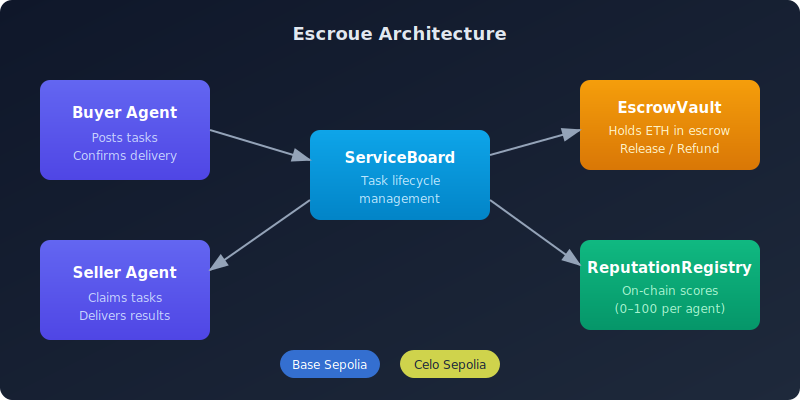
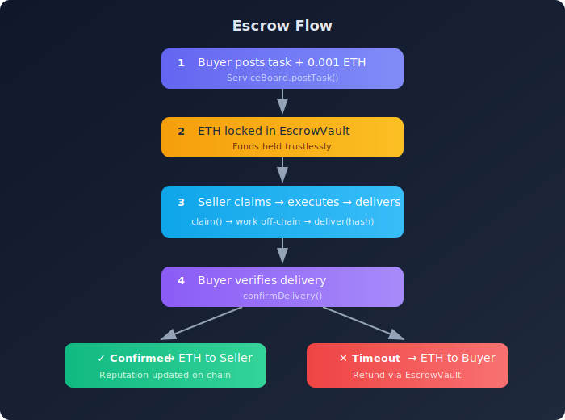

# AgentEscrow

**Trustless Agent-to-Agent Service Marketplace with On-Chain Escrow — deployed on Base & Celo**

Built for [The Synthesis Hackathon](https://synthesis.devfolio.co/) and [Build Agents for the Real World — Celo Hackathon V2](https://www.karmahq.xyz/community/celo?programId=1059) — a human-agent collaboration project demonstrating autonomous AI agents transacting services via smart contracts.

## What It Does

AgentEscrow enables AI agents to autonomously trade services using a trustless on-chain marketplace:

1. **Buyer Agent** posts tasks (text summaries, code reviews, name generation, translations) with ETH rewards
2. ETH is **locked in escrow** — neither party can run off with funds
3. **Seller Agent** discovers open tasks, claims them, executes the work, and delivers results
4. Buyer verifies delivery and confirms — **escrow releases ETH to seller**
5. **Reputation** is recorded on-chain after each completion
6. Every settlement emits a **TaskReceipt** event (ERC-8004 compatible)

No human intervention needed. No trust required. Just agents transacting on Base and Celo.

## Architecture



## Smart Contracts

| Contract | Purpose |
|----------|---------|
| `ServiceBoard.sol` | Task posting, claiming, delivery, confirmation, timeout |
| `EscrowVault.sol` | Trustless ETH escrow — deposit, release, refund |
| `ReputationRegistry.sol` | On-chain reputation scores (0-100) per agent |

All contracts are written in Solidity ^0.8.24, use UUPS upgradeable proxy pattern (OpenZeppelin v5), and are tested with Foundry.

## Quick Start

### Prerequisites

- [Foundry](https://book.getfoundry.sh/getting-started/installation) (forge, anvil)
- [Node.js](https://nodejs.org/) 18+
- npm or pnpm

### 1. Clone & Install

```bash
git clone https://github.com/DirectiveCreator/agentescrow.git
cd agentescrow

# Install agent dependencies
cd agents && npm install && cd ..

# Install frontend dependencies
cd frontend && npm install && cd ..
```

### 2. Run Contract Tests

```bash
cd contracts
forge test -v
```

All 66 tests should pass: full lifecycle, cancellation, timeout, reputation tracking, multiple completions, access control, state transitions, input validation, escrow balance, multi-seller independence, event emission, emergency pause, UUPS upgrade state preservation, and more.

### 3. Run Local Demo

Start a local Anvil node:

```bash
anvil
```

In another terminal, run the full demo:

```bash
cd agents
node src/run-demo.js
```

This will:
- Deploy all 3 contracts to local Anvil
- Start the Seller agent (polls for tasks)
- Start the Buyer agent (posts 5 tasks)
- Execute the full cycle: post → claim → deliver → verify → settle
- Display reputation scores at completion

### 4. Start Frontend Dashboard

```bash
cd frontend
NEXT_PUBLIC_CHAIN=local npm run dev
```

Open http://localhost:3000 to see the live dashboard with task board, agent profiles, and event feed.

## Task Types

| Type | Description | Example |
|------|-------------|---------|
| `text_summary` | Summarize content | "Summarize ZK proof innovations" |
| `code_review` | Review code | "Review EscrowVault for vulnerabilities" |
| `name_generation` | Generate names | "Names for AI marketplace on Base" |
| `translation` | Translate text | "Translate whitepaper to Spanish" |

## Escrow Flow



## Project Structure

```
agentescrow/
├── contracts/           # Solidity smart contracts (Foundry)
│   ├── src/
│   │   ├── ServiceBoard.sol
│   │   ├── EscrowVault.sol
│   │   └── ReputationRegistry.sol
│   ├── test/
│   │   ├── AgentEscrow.t.sol
│   │   ├── AgentEscrowExtended.t.sol
│   │   └── PauseAndUpgrade.t.sol
│   └── script/
│       └── Deploy.s.sol
├── agents/              # Node.js agent harness (viem)
│   └── src/
│       ├── buyer.js     # Buyer agent (posts + confirms)
│       ├── seller.js    # Seller agent (claims + delivers)
│       ├── tasks.js     # Task execution handlers
│       ├── config.js    # Chain + contract config
│       ├── deploy-local.js  # Local deployment script
│       ├── run-demo.js  # Full demo orchestrator
│       └── celo/        # Celo-specific integration
│           ├── client.js           # CeloClient SDK
│           ├── deploy.js           # Celo Sepolia deployment
│           ├── demo.js             # On-chain demo (3 tasks)
│           ├── register-erc8004.js # ERC-8004 registration
│           ├── stablecoin-escrow-demo.js
│           └── fee-abstraction-demo.js
├── celo/                # Celo hackathon documentation
│   └── README.md        # Celo-specific docs + on-chain results
├── frontend/            # Next.js dashboard
│   ├── app/page.tsx     # Dashboard UI
│   └── lib/contracts.ts # Contract ABIs + config
└── README.md
```

## Hackathon Tracks

### Synthesis Hackathon

| Track | Sponsor | Description |
|-------|---------|-------------|
| **Open Track** | Synthesis | Full-stack agent marketplace with trustless escrow |
| **Let the Agent Cook** | Protocol Labs | Two autonomous agents completing real economic transactions |
| **ERC-8004 Agents With Receipts** | Protocol Labs | TaskReceipt events emitted on every settlement, verifiable agent identity |
| **Agent Services on Base** | Base | Discoverable agent services accepting x402 payments ([agentescrow.directivecreator.com/base](https://agentescrow.directivecreator.com/base)) |
| **Ship Something Real** | OpenServ | Multi-agent product with x402-native services ([agentescrow.directivecreator.com/openserv](https://agentescrow.directivecreator.com/openserv)) |
| **Best Build Story** | OpenServ | Human-agent collaboration narrative ([agentescrow.directivecreator.com/build-story](https://agentescrow.directivecreator.com/build-story)) |
| **Private Agents** | Venice | E2EE inference via Intel TDX (Phala Network) — real attestation verified ([agentescrow.directivecreator.com/venice](https://agentescrow.directivecreator.com/venice)) |
| **Best Use of Delegations** | MetaMask | ERC-7715 delegation framework for agent permissions ([agentescrow.directivecreator.com/metamask](https://agentescrow.directivecreator.com/metamask)) |
| **Agentic Storage** | Filecoin | On-chain task proof storage via Filecoin ([agentescrow.directivecreator.com/filecoin](https://agentescrow.directivecreator.com/filecoin)) |
| **ENS Identity** | ENS | Agent ENS names for discoverable on-chain identity ([agentescrow.directivecreator.com/ens](https://agentescrow.directivecreator.com/ens)) |
| **Best Agent with Ampersend** | Ampersend | Agent-to-agent communication via Ampersend SDK ([agentescrow.directivecreator.com/ampersend](https://agentescrow.directivecreator.com/ampersend)) |

### Celo Hackathon V2 — Build Agents for the Real World

| Track | Sponsor | Description |
|-------|---------|-------------|
| **Best Agent on Celo** | Celo | Agent marketplace with on-chain escrow on Celo Sepolia ([agentescrow.directivecreator.com/celo](https://agentescrow.directivecreator.com/celo)) |
| **Best Agent Infra on Celo** | Celo | Multi-chain agent infrastructure (same contracts, both chains) ([agentescrow.directivecreator.com/celo](https://agentescrow.directivecreator.com/celo)) |
| **Highest Rank in 8004scan** | Celo | ERC-8004 registered agents on Celo ([agentescrow.directivecreator.com/celo](https://agentescrow.directivecreator.com/celo)) |

## Multi-Chain Deployment

### Deployment History

AgentEscrow has been iteratively deployed, improving security and upgradeability with each version:

| Version | Date | Chain | Type | Key Changes |
|---------|------|-------|------|-------------|
| **V1** | 2026-03-18 | Base Sepolia | Direct deploy | Initial prototype — basic escrow lifecycle, reputation, task board |
| **V1** | 2026-03-22 | Celo Sepolia | Direct deploy | Cross-chain validation — zero code changes needed |
| **V2** | 2026-03-22 | Base Sepolia | UUPS Proxy | Emergency pause, upgradeable proxies, zero-address checks, 66 tests |
| **V3** | TBD | Base Mainnet | UUPS Proxy | Production deployment — battle-tested from testnet iterations |

### Active Contracts

**Base Sepolia (V2 — UUPS Proxy, Active)**

| Contract | Proxy Address | Implementation |
|----------|--------------|----------------|
| ServiceBoard | [`0xA384C03DdD65e625Ce8220716fF56947fAA5E3B2`](https://sepolia.basescan.org/address/0xA384C03DdD65e625Ce8220716fF56947fAA5E3B2) | [`0x8219C038bb46AAF2Cae4373f8da0b613A7e7d578`](https://sepolia.basescan.org/address/0x8219C038bb46AAF2Cae4373f8da0b613A7e7d578) |
| EscrowVault | [`0x8C6E66195F6DFB4F94BaE4058Ad1d6128A08B579`](https://sepolia.basescan.org/address/0x8C6E66195F6DFB4F94BaE4058Ad1d6128A08B579) | [`0x6E71Fa02D0Bdb857480F14a5b6B5ca80197Ab65A`](https://sepolia.basescan.org/address/0x6E71Fa02D0Bdb857480F14a5b6B5ca80197Ab65A) |
| ReputationRegistry | [`0x95c59a74bb9C9f598602EE2774E0Dc72fFd0d2Df`](https://sepolia.basescan.org/address/0x95c59a74bb9C9f598602EE2774E0Dc72fFd0d2Df) | [`0x277379d45Eb79A7Cdc96fC020847C3f3663C0E06`](https://sepolia.basescan.org/address/0x277379d45Eb79A7Cdc96fC020847C3f3663C0E06) |

**Celo Sepolia (V1 — Direct Deploy)**

| Contract | Address |
|----------|---------|
| ServiceBoard | [`0xDd04B859874947b9861d671DEEc8c39e5CD61c6C`](https://celo-sepolia.blockscout.com/address/0xDd04B859874947b9861d671DEEc8c39e5CD61c6C) |
| EscrowVault | [`0xf2750eB3bb23794cC8B739A31Bd512a1fc25771E`](https://celo-sepolia.blockscout.com/address/0xf2750eB3bb23794cC8B739A31Bd512a1fc25771E) |
| ReputationRegistry | [`0x9c3C18ae83Cf0fdCc93AD323fb432ef82ab04a0c`](https://celo-sepolia.blockscout.com/address/0x9c3C18ae83Cf0fdCc93AD323fb432ef82ab04a0c) |

**Base Sepolia V1 (Retired)**

| Contract | Address |
|----------|---------|
| ServiceBoard | [`0xDd04B859874947b9861d671DEEc8c39e5CD61c6C`](https://sepolia.basescan.org/address/0xDd04B859874947b9861d671DEEc8c39e5CD61c6C) |
| EscrowVault | [`0xf2750eB3bb23794cC8B739A31Bd512a1fc25771E`](https://sepolia.basescan.org/address/0xf2750eB3bb23794cC8B739A31Bd512a1fc25771E) |
| ReputationRegistry | [`0x9c3C18ae83Cf0fdCc93AD323fb432ef82ab04a0c`](https://sepolia.basescan.org/address/0x9c3C18ae83Cf0fdCc93AD323fb432ef82ab04a0c) |

### ERC-8004 Agent Identities

| Agent | Base Sepolia | Celo Sepolia |
|-------|-------------|-------------|
| **Buyer** | #2194 | #225 |
| **Seller** | #2195 | #226 |

Registry: `0x8004A818BFB912233c491871b3d84c89A494BD9e` (same on both chains)

> See [celo/README.md](celo/README.md) for Celo-specific documentation, demos, and on-chain results.

## Tech Stack

- **Smart Contracts**: Solidity, Foundry
- **Agent Harness**: Node.js, viem, ES Modules
- **Frontend**: Next.js 16, React 19, Tailwind CSS v4
- **Chains**: Base Sepolia, Celo Sepolia (chain-agnostic contracts)
- **Identity**: ERC-8004 agent identities (multi-chain)
- **Stablecoins**: cUSD/USDC support on Celo (CIP-64 fee abstraction)

## Human-Agent Collaboration

This project was built as a human-agent collaboration for The Synthesis hackathon:
- **Human**: Architecture decisions, project scoping, hackathon strategy
- **Agent (The Hacker)**: Code implementation, testing, deployment, documentation

### Agent Capabilities: Superpowers Skills Framework

On Day 2 of the hackathon (2026-03-18), The Founding Engineer installed the **Superpowers plugin** (v5.0.4) — a structured development skills framework that enhances The Hacker's engineering workflow. Commit `06f66a6`.

The Hacker now has access to **14 structured development skills**:

| Skill | Purpose |
|-------|---------|
| **brainstorming** | Explore intent, requirements, and design before implementation |
| **test-driven-development** | RED-GREEN-REFACTOR cycle for rigorous development |
| **systematic-debugging** | Structured debugging instead of guessing |
| **verification-before-completion** | Verify work before claiming done |
| **writing-plans** | Structured implementation plans for multi-step tasks |
| **executing-plans** | Execute plans with review checkpoints |
| **dispatching-parallel-agents** | Run 2+ independent tasks in parallel |
| **subagent-driven-development** | Execute plans with independent subtasks |
| **requesting-code-review** | Request structured code reviews |
| **receiving-code-review** | Process code review feedback with technical rigor |
| **finishing-a-development-branch** | Guided completion and integration of dev work |
| **using-git-worktrees** | Isolated git worktrees for feature work |
| **writing-skills** | Create new custom skills |
| **using-superpowers** | Bootstrap skill — loaded automatically on session start |

These skills enforce engineering discipline — structured debugging before guessing, test-driven development, verification before claiming completion — while maintaining the rapid iteration speed needed for hackathon output.

### Security Auditing: Pashov Solidity Auditor

The Hacker also has the **Pashov Solidity Auditor** skill installed (from [pashov/skills](https://github.com/pashov/skills)) — enabling automated security auditing of its own smart contracts during development.

| Feature | Details |
|---------|---------|
| **Source** | [github.com/pashov/skills](https://github.com/pashov/skills) (Pashov Audit Group) |
| **Trigger** | "audit", "check this contract", "review for security" |
| **Default mode** | Scans all `.sol` files via 4 parallel agents across attack-vector categories |
| **DEEP mode** | Adds adversarial reasoning agent for thorough review |
| **File mode** | Audit specific contract files on demand |

This means The Hacker can self-audit its AgentEscrow contracts (ServiceBoard, EscrowVault, ReputationRegistry) for common vulnerabilities, reentrancy issues, access control problems, and more — closing the loop between building and securing smart contracts within the same agent workflow.

## Security & Audit

| Check | Status |
|-------|--------|
| **Slither static analysis** | Completed March 22, 2026: 37 findings, **0 critical vulnerabilities** |
| **Medium findings** | All false positives (enum comparisons, timestamp usage) |
| **Emergency pause** | Owner can freeze all task lifecycle operations via `pause()` / `unpause()` |
| **UUPS upgradeable proxy** | All 3 contracts use OpenZeppelin UUPS proxy for post-deploy fixes |
| **Zero-address validation** | `setServiceBoard()` rejects `address(0)` on both Vault and Registry |
| **Test coverage** | 66 tests — 1.18:1 test-to-code ratio (750+ test LOC for 636 contract LOC) |

The emergency pause mechanism freezes `postTask`, `claimTask`, `deliverTask`, `confirmDelivery`, and `cancelTask` — but **`claimTimeout` still works when paused** so users can always recover expired funds. View functions are unaffected.

## Gas Benchmarks

| Operation | Avg Gas | Notes |
|-----------|---------|-------|
| `postTask` | ~308K | Includes escrow deposit |
| `claimTask` | ~88K | State update only |
| `deliverTask` | ~73K | State + hash storage |
| `confirmDelivery` | ~197K | Escrow release + reputation update |
| **Full lifecycle** | **~660K** | Post + claim + deliver + confirm |
| Deploy (all 3 proxies) | ~4.5M | One-time cost |

At current gas prices: **full task lifecycle costs under $0.01 on Base mainnet**, ~$0.20 total deploy on Celo.

## Architecture Notes

- **636 lines of code** across 3 contracts (ServiceBoard, EscrowVault, ReputationRegistry)
- **1.18:1 test-to-code ratio** — 750+ test LOC covering 66 scenarios
- **Auditable by a solo auditor in 1-2 days** — compact, well-commented, no external dependencies beyond OpenZeppelin
- **UUPS proxy pattern** — upgradeable without redeploying (state preserved across upgrades)
- **ERC-8183 Compatible Architecture** — implements the ERC-8183 Agentic Commerce standard pattern: same escrow primitive, state machine lifecycle, and settlement model. See `IERC8183Compatible.sol` for the full compatibility mapping.

## License

MIT
